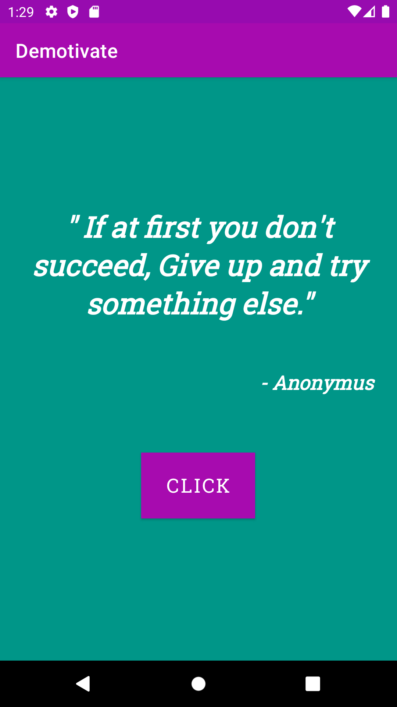

<div align="center">
 <p>
    
  </p>
  <h1>Demotivate</h1>

  <div align="center">
    <b>Because motivational quotes are too mainstream 😎</b>
  </div>
</div>

## Description

An Android application that shows the user random demotivational quotes fetched from
the [Demotivational Quotes GraphQL API](https://github.com/aravindasiva/demotivational-quotes-api).

## Architecture

The application follows the Model, View, ViewModel (MVVM) software architectural pattern.
With the following file and directory structure:

```
📦app
 ┣ ..
 ┣ 📂src
 ┃ ┣ 📂main
 ┃ ┃ ┣ 📂graphql
 ┃ ┃ ┃ ┣ 📂queries
 ┃ ┃ ┃ ┃ ┗ 📜quotes.graphql
 ┃ ┃ ┃ ┗ 📜schema.graphqls
 ┃ ┃ ┣ 📂java
 ┃ ┃ ┃ ┗ 📂com.example.demotivate
 ┃ ┃ ┃    ┣ 📂graphql
 ┃ ┃ ┃    ┃ ┗ 📜Apollo.kt
 ┃ ┃ ┃    ┣ 📂view
 ┃ ┃ ┃     ┃ ┗ 📜MainActivity.kt
 ┃ ┃ ┃     ┗ 📂viewmodel
 ┃ ┃ ┃      ┗ 📜QuotesViewModel.kt
 ┃ ┃ ┗ ..
 ┃ ┣ ..
 ┗ ..
```

### Model

- Given a GraphQL schema and query definition, the Apollo Kotlin plugin defines a Gradle task named `generateApolloSources` to
  generate the models

### View

- Fetches all quotes via Apollo client and sends them to the ViewModel
- Controls the application's display of the quotes and interaction with the user through the button
- Triggers and subscribes to the ViewModel's `LiveData` updates

### ViewModel

- Updates the `MutableLiveData` with a random quote

## Screenshots

<span>
  

  
</span>

